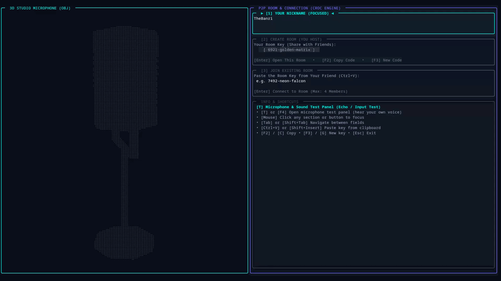

<p align="center">
  
</p>

<h1 align="center">🍋 Limoni Voice</h1>

<p align="center">
  <b>Terminal Tabanlı • Uçtan Uca Şifreli • P2P Sesli Konuşma & Ekran Paylaşımı</b>
</p>

<p align="center">
  <a href="#-kurulum"></a>
  <a href="LICENSE"></a>
  <a href="#"></a>
  <a href="#"></a>
</p>

<p align="center">
  <i>Tamamen terminal içinde çalışan, sıfır bağımlılıklı, gerçek zamanlı P2P sesli konuşma uygulaması.<br/>
  <a href="https://github.com/thebanri/limoni">Limoni TUI Framework</a> ile Go dilinde yazılmıştır.</i>
</p>

<p align="center">
  <a href="README.md">English</a> • <b>Türkçe</b>
</p>

<p align="center">
  
</p>

---

## ✨ Özellikler

<table>
<tr>
<td width="50%">

### 🎙️ Sesli Konuşma
- **Full-Mesh P2P**: 4 kişilik oda, doğrudan peer-to-peer UDP
- **AES-256-GCM Şifreleme**: Tüm ses ve kontrol paketleri uçtan uca şifreli
- **VAD (Voice Activity Detection)**: Konuşan kişi anlık olarak tespit edilir
- **Gürültü Bastırma**: Çok kademeli filtre sistemi (KAPALI / AÇIK / YÜKSEK)
- **Canlı VU-Meter**: Her katılımcının ses seviyesi gerçek zamanlı görselleştirilir

</td>
<td width="50%">

### 🖥️ Ekran Paylaşımı
- **60 FPS Donanım Hızlandırmalı** ekran yakalama (1080p, ultra düşük gecikme)
- **Linux Masaüstü Ortamı Desteği**:
  - **GNOME (Wayland & X11)**: ✅ **Test Edildi & Düzgün Çalışıyor** (Doğrudan Mutter PipeWire & Portal pencere seçici)
  - **KDE Plasma (Wayland & X11)**: ✅ **Test Edildi & Düzgün Çalışıyor** (XDG Desktop Portal PipeWire yakalama)
  - **Diğer Ortamlar (Hyprland, Sway, XFCE vb.)**: ⚠️ *Deneysel / Henüz Test Edilmedi* (GPU Screen Recorder / FFmpeg fallback)
- **Windows**: Pencere ve ekran bazlı seçim ile GDI/DXGI capture
- **macOS**: Yerel sistem portalı ile entegrasyon
- **MPV / FFplay** ile ultra düşük gecikmeli izleme deneyimi

</td>
</tr>
<tr>
<td width="50%">

### 🌐 Ağ Mimarisi
- **LAN Otomatik Keşif**: Broadcast paketleri ile yerel ağda sıfır-konfigürasyon
- **İnternet P2P**: WebSocket relay sunucusu ile NAT geçişi ve hole-punching
- **Relay Sunucusu**: Railway üzerinde barındırılan ultra hafif Go sunucusu (~7 MB Docker image)
- **HMAC-SHA256**: Paket bütünlük doğrulaması

</td>
<td width="50%">

### 🎨 Arayüz & Deneyim
- **3D Stüdyo Mikrofonu**: Braille Canvas üzerinde 60 FPS dönen 3D model
- **Fare ile 3D Döndürme**: Drag & scroll ile interaktif kontrol
- **Animasyonlu Modallar**: Yumuşak geçişli dialog pencereleri
- **Neon Renk Paleti**: Cyberpunk estetiğinde modern TUI tasarımı
- **Toast Bildirimleri**: Anlık durum mesajları

</td>
</tr>
</table>

---

## 🏗️ Mimari

```
                          ┌─────────────────────────────────┐
                          │   WebSocket Relay Server        │
                          │   (Railway / Docker / Self-Host)│
                          │   NAT Traversal & Hole-Punch    │
                          └──────────┬──────────────────────┘
                                     │ WSS
                     ┌───────────────┼───────────────┐
                     │               │               │
              ┌──────▼──────┐ ┌──────▼──────┐ ┌──────▼──────┐
              │   Peer A    │ │   Peer B    │ │   Peer C    │
              │  (Host)     │ │             │ │             │
              ├─────────────┤ ├─────────────┤ ├─────────────┤
              │ Audio Engine│ │ Audio Engine│ │ Audio Engine│
              │ Screen Share│ │ Screen Share│ │ Screen Share│
              │ TUI Render  │ │ TUI Render  │ │ TUI Render  │
              └──────┬──────┘ └──────┬──────┘ └──────┬──────┘
                     │               │               │
                     └───── UDP P2P Full-Mesh ───────┘
                           (AES-256-GCM Encrypted)
```

### Proje Yapısı

```
limoni-voice/
├── main.go              # Uygulama giriş noktası, event loop & ekran yönetimi
├── network.go           # P2P mesh ağı, şifreleme, WebSocket relay istemcisi
├── audio.go             # Ses motoru: yakalama, oynatma, VAD, gürültü filtresi
├── ui_lobby.go          # Lobi ekranı: 3D mikrofon, input alanları, menü
├── ui_room.go           # Oda ekranı: katılımcı kartları, VU-meter, loglar
├── dialogs.go           # Modal dialoglar: çıkış, ayrılma, ses testi, ekran paylaşımı
├── microphone3d.go      # 3D stüdyo mikrofon modeli (polygon & wireframe)
├── screenshare/         # Ekran paylaşımı modülü (GPU Rec, FFmpeg, MPV)
├── clipboard.go         # Platformlar arası pano desteği
├── roomcode.go          # Croc tarzı oda kodu üreteci
├── relay-server/        # WebSocket relay sunucusu (bağımsız Go modülü)
├── scripts/             # Build & paketleme scriptleri
├── release_assets/      # Derlenmiş binary'ler ve installer'lar
├── dist/                # Platform bazlı dağıtım paketleri
└── assets/              # Logo, ikonlar
```

---

## 🚀 Kurulum

### Ekran Paylaşımı İçin Ön Gereksinimler (FFmpeg & MPV)

> [!IMPORTANT]
> Sesli konuşma özelliği tamamen sıfır bağımlılıkla doğrudan çalışır. Ancak **Ekran Paylaşımı** (yayın açma ve canlı yayın izleme) özelliklerini kullanabilmek için sisteminizde **FFmpeg** ve **MPV Player** kurulu olmalıdır:
>
> - **🍎 macOS (Homebrew)**:
>   ```bash
>   brew install ffmpeg mpv
>   ```
> - **🪟 Windows (winget / choco / scoop)**:
>   ```powershell
>   # winget ile
>   winget install -e --id Gyan.FFmpeg
>   winget install -e --id shinchiro.mpv
>
>   # veya Chocolatey ile
>   choco install ffmpeg mpv
>
>   # veya Scoop ile
>   scoop install ffmpeg mpv
>   ```
>   *(Not: `Limoni-Voice-Setup_windows_amd64.exe` kurulum sihirbazı bunları sizin için otomatik olarak da kurabilir).*
> - **🐧 Linux (Debian / Ubuntu / Arch)**:
>   ```bash
>   # Debian / Ubuntu
>   sudo apt install ffmpeg mpv
>   # Arch Linux
>   sudo pacman -S ffmpeg mpv
>   ```

### Hazır Binary İndirme (Önerilen)

[**Releases**](https://github.com/thebanri/limoni-voice/releases) sayfasından platformunuza uygun paketi indirin:

| Platform | Mimari | Dosya |
|----------|--------|-------|
| 🐧 Linux | amd64 | `limoni-voice_v1.0.0_linux_amd64.tar.gz` |
| 🐧 Linux | arm64 | `limoni-voice_v1.0.0_linux_arm64.tar.gz` |
| 🍎 macOS | Apple Silicon | `Limoni-Voice_v1.0.0_macOS_arm64.app.zip` |
| 🍎 macOS | Intel | `Limoni-Voice_v1.0.0_macOS_amd64.app.zip` |
| 🪟 Windows | amd64 | `Limoni-Voice-Setup_windows_amd64.exe` |
| 🪟 Windows | arm64 | `Limoni-Voice-Setup_windows_arm64.exe` |

```bash
# Linux / macOS
tar xzf limoni-voice_v1.0.0_linux_amd64.tar.gz
./limoni-voice
```

### Kaynaktan Derleme

```bash
# Gereksinimler: Go 1.24+
git clone https://github.com/thebanri/limoni-voice.git
cd limoni-voice
go build -o limoni-voice .
./limoni-voice
```

### Windows Otomatik Kurulum

```powershell
# PowerShell ile tek komutla kurulum
irm https://raw.githubusercontent.com/thebanri/limoni-voice/main/scripts/install-windows.ps1 | iex
```

### Docker ile Kendi Relay Sunucunuzu Barındırma

```bash
# 1. Kendi WebSocket relay sunucusu konteynerinizi başlatın
docker build -t limoni-relay .
docker run -d --name limoni-relay -p 8080:8080 limoni-relay

# 2. İstemcileri kendi sunucunuza bağlayın
./limoni-voice --relay ws://192.168.1.100:8080/ws

# Alternatif olarak ortam değişkeniyle tanımlayın:
export LIMONI_RELAY_URL="ws://192.168.1.100:8080/ws"
./limoni-voice
```

### LAN Modu (Çevrimdışı / İnternetsiz Yerel Ağ)

Limoni Voice'u internet erişimi olmayan izole yerel ağlarda çalıştırmak için:

```bash
# Doğrudan LAN P2P modunda başlat (Relay sunucusu devre dışı bırakılır)
./limoni-voice --lan

# Veya ortam değişkeniyle:
export LIMONI_LAN_ONLY=1
./limoni-voice
```

---

## ⚙️ Komut Satırı Parametreleri & Konfigürasyon

| Parametre | Ortam Değişkeni | Varsayılan | Açıklama |
|-----------|-----------------|------------|----------|
| `--relay <url>` | `LIMONI_RELAY_URL` | `wss://limoni-voice-production.up.railway.app/ws` | Kendi relay sunucunuzun WebSocket adresi |
| `--lan`, `--lan-only` | `LIMONI_LAN_ONLY` | `false` | Sadece yerel ağ modunu zorlar (internet relay'i kapatır) |
| `--offline` | `LIMONI_OFFLINE` | `false` | `--lan` parametresinin takma adı |
| `--peer <ip:port>` | `LIMONI_PEER` | `""` | Farklı alt ağlar veya VPN için doğrudan hedef eş IP/adresi |
| `--connect <ip:port>` | `LIMONI_PEER` | `""` | `--peer` parametresinin takma adı |
| `--version` | - | - | Sürüm bilgisini gösterir |
| `--help`, `-h` | - | - | Yardım ve kullanım parametrelerini listeler |

---

## 🎮 Kullanım ve Kısayollar

### Hızlı Başlangıç

```bash
# 1. Uygulamayı başlatın
./limoni-voice

# 2. Otomatik oluşturulan oda anahtarınız karşınıza çıkar (örn: 9421-azure-wave)
# 3. [Enter] ile odayı başlatın
# 4. Arkadaşınıza anahtarı gönderin!
```

### Lobi Ekranı Kısayolları

| Tuş | Aksiyon |
|-----|---------|
| `Tab` / `Shift+Tab` | Alanlar arası geçiş |
| `Enter` | Odayı başlat veya katıl |
| `C` / `F2` | Oda anahtarını panoya kopyala |
| `G` / `F3` | Yeni oda anahtarı üret |
| `T` / `F4` | Ses test modalını aç |
| `Esc` | Çıkış onayı |
| `Ctrl+V` | Panodan yapıştır |
| `🖱️ Sürükle` | 3D mikrofonu döndür |
| `🖱️ Scroll` | Yakınlaştır / Uzaklaştır |

### Oda Ekranı Kısayolları

| Tuş | Aksiyon |
|-----|---------|
| `M` | 🎙️ Mikrofon Aç / Kapat |
| `D` | 🔇 Kulaklık Kapat (Sağırlaştır) |
| `N` | 🔊 Gürültü filtresi modunu değiştir |
| `V` | 🖥️ Ekran paylaşımını başlat / durdur |
| `W` | 👁️ Ekran yayınını izle |
| `C` / `F2` | 📋 Oda kodunu kopyala |
| `+` / `-` | 🔉 Mikrofon ses seviyesini ayarla |
| `T` | 🧪 Ses test modalı |
| `Esc` | Odadan ayrıl |

---

## 🔐 Güvenlik

Limoni Voice, güvenliği temel bir prensip olarak ele alır:

| Katman | Teknoloji | Açıklama |
|--------|-----------|----------|
| **Ses Şifreleme** | AES-256-GCM | Her ses paketi uçtan uca şifrelenir |
| **Paket Doğrulama** | HMAC-SHA256 | Paket bütünlüğü ve kimlik doğrulama |
| **Anahtar Türetme** | SHA-256 | Oda kodundan türetilen benzersiz şifreleme anahtarı |
| **Magic Prefix** | `LVS1` | Protokol versiyonu ve paket doğrulama başlığı |
| **Transport** | WSS (TLS 1.3) | Relay sunucu bağlantısı şifreli WebSocket |

> **Hiçbir ses verisi relay sunucusunda işlenmez veya depolanmaz.** Relay yalnızca peer keşfi ve NAT traversal için kullanılır. Gerçek ses iletişimi doğrudan peer-to-peer UDP üzerinden gerçekleşir.

---

## 🛠️ Bağımlılıklar

### Çalışma Zamanı (Opsiyonel)

| Araç | Platform | Amaç |
|------|----------|------|
| [FFmpeg](https://ffmpeg.org) | Tümü | Video encoding/transcoding |
| [GPU Screen Recorder](https://git.dec05eba.com/gpu-screen-recorder) | Linux | GPU hızlandırmalı ekran yakalama |
| [MPV](https://mpv.io) | Tümü | Düşük gecikmeli video oynatıcı |

### Go Modülleri

| Modül | Amaç |
|-------|------|
| [`github.com/thebanri/limoni`](https://github.com/thebanri/limoni) | TUI framework (terminal, widget, grafik, animasyon) |
| [`github.com/gorilla/websocket`](https://github.com/gorilla/websocket) | WebSocket relay istemcisi |
| [`golang.org/x/sys`](https://pkg.go.dev/golang.org/x/sys) | Platform-native sistem çağrıları |

---

## 🧪 Testler

```bash
# Tüm testleri çalıştır
go test -v ./...

# Sadece birim testleri
go test -v -run TestRoomCode
go test -v -run TestAudioEngine

# Relay sunucu testleri
cd relay-server && go test -v ./...
```

---

## 🤝 Katkıda Bulunma

1. Bu repoyu **fork** edin
2. Feature branch oluşturun (`git checkout -b feature/harika-ozellik`)
3. Değişikliklerinizi commit edin (`git commit -m 'feat: harika özellik eklendi'`)
4. Branch'inizi push edin (`git push origin feature/harika-ozellik`)
5. **Pull Request** açın

---

## 📄 Lisans

Bu proje [MIT Lisansı](LICENSE) altında lisanslanmıştır.

---

<p align="center">
  <sub>
    <b>Limoni Voice</b> 💛 açık kaynak topluluğu tarafından geliştirilmektedir.<br/>
    <a href="https://github.com/thebanri/limoni">Limoni TUI Framework</a> ile ❤️ ile yapılmıştır.
  </sub>
</p>
